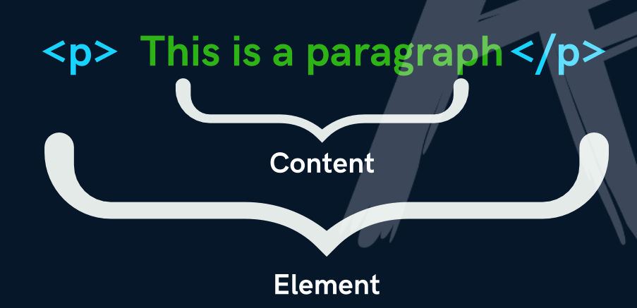

# HTML, CSS, JS
HTML = Structure/layout.
CSS = Style.
JS = Logic.

# HTML
Hyper Text Markup Language

HTML is the code that is used to structure a web page and its content.

The component used to design the sturcture of websites are called HTML tags.

## First HTML File
index.html

It is the default name for a website's homepage.

## HTML Tag
A container for some content or other HTML tags.

